## Login:

- Login using credential given by the administrator
- After login, assign yourself to the corresponding cutting machine
    - You can override any other user using the machine, if need be
- Assign a helper to the cutting machine

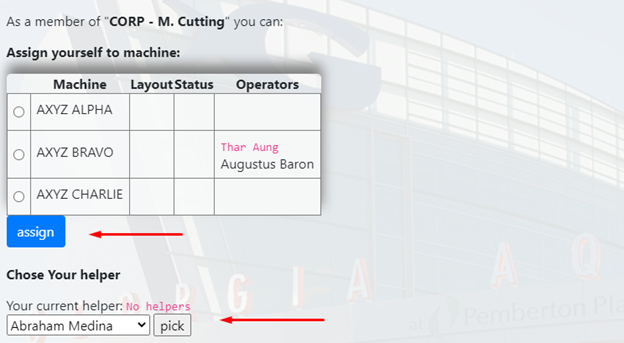

## Choosing a Job Task

- Click the Production tab (Top of the page)
- Choose task according to what is scheduled

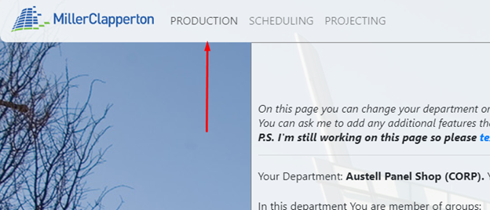

- Alternatively, the Schedules tab (Top of the page) shows tasks by most recent
- Choose link for Program Nest Layouts (ID Number)

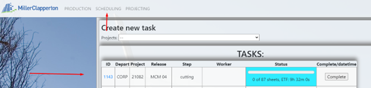

- Click START THIS LAYOUT button to reserve the task before quality checks and confirm by clicking OK
    - Background should turn brown to show task is reserved
    - If this button is not shown, the machine is not assigned.
    - Click on the name profile in top right corner to go back and assign the machine

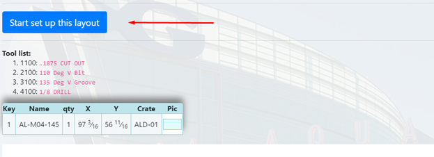

- Click the material needed for the job task
- Check to make sure the toolset and information is correct and working properly
- Display the part drawings for the task by clicking on the word PIC

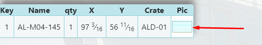
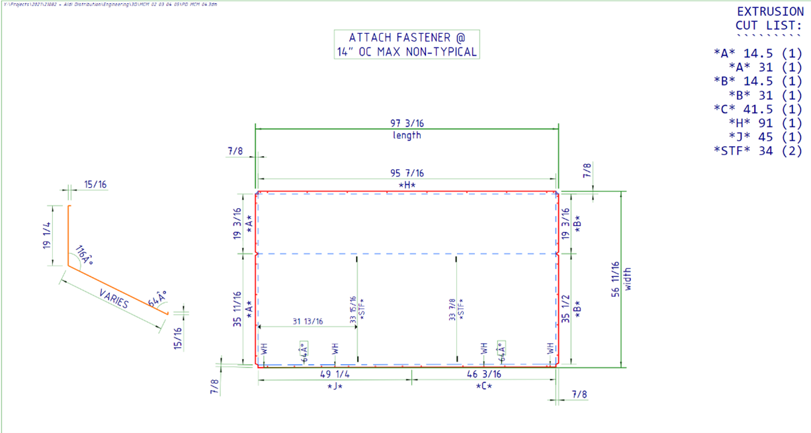

- Make sure picture below task layout matches the picture on the machine itself
- Check line depth colors
    - If it does not match, check machine for correct program
    - If it still does not match, check with cutting programmer

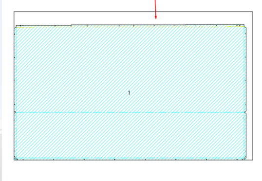

## Loading Material:

- “Material loaded” means material is already loaded on the machine and ready to go
- Start by pushing button on the machine and in the same instance, click “Material Loaded” from the program
- Once the process starts, the background turns green to show task is working to be complete

- Click “Stop/Unload Material” to interrupt a job before it is completely finished
- This releases the task from the machine
    - DO THIS ONLY IF MATERIAL IS NOT DAMAGED!!!

- Click the name profile in the top left goes back to the assignment screen and shows what tasks are in progress and who is working on said task
- By clicking “Pause,” this will stop progress from the task temporarily for lunch or break when the machine is unattended. Click “Resume” to begin again
- The background will turn PURPLE when Paused
- On the assignment screen, the time will be recorded of how long the machine was paused and by which operator

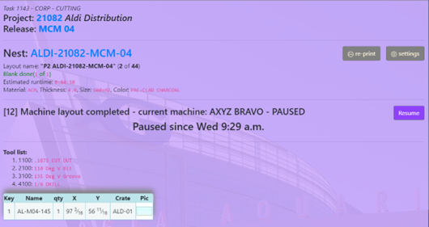
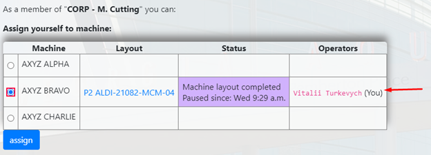

## Completed Process:

- Once the cutting task is completed, the program will display results to choose for the cutting task.
- RESULTS:
    - COMPLETED: When the task is complete with some or no errors
    - FAILED: Incomplete/Everything fails (material can no longer be used)

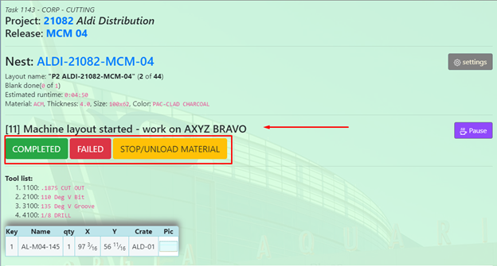

- Click “Complete” when cutting task is done with some or no errors
- The background changes to BLUE and shows option to choose Complete or Fail
- If multiple cutting tasks, click which tasks are completed and which failed

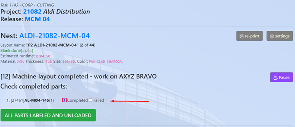

## Quality Control:

- Quality Control is one of the most important steps in this process
- Make sure label matches Panel number
- Make sure all panels are checked complete or fail
- Make sure label is placed in an appropriate area where it can be seen and not hidden, even when folded (Usually the biggest area of the panel)

- Once quality control is complete, click “All Parts Labeled and Unloaded”
- Click “Reprint” for any labels that may be damaged or unreadable

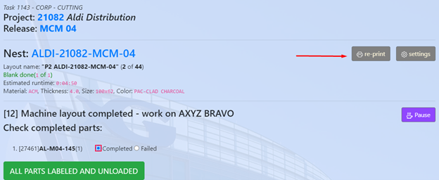

- Once completed you will get a notification window

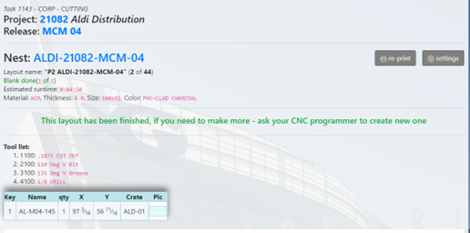

## Advanced Cutting:

- To assign multiple machines to do multiple tasks at once, click on name profile in top right corner of the program and assign to multiple cutting machines.
    - This also allows one to go back and forth between all assigned machines
    - Click on each task to go back and forth
- Dividing total time completion by number of machines running at the same time
- Make sure labels match multiple materials by job number

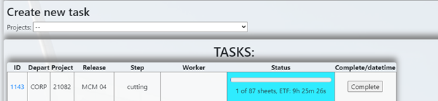

## Guidelines to Remember

- Always check to make sure your name is by operator. If not, assign to a cutting machine
- Follow each task as directed and do not click ahead of the assigned task
    - This causes error within the program
- Slow down and go by the manual. This will make the program and process go smoothly
- If material has not been properly laid out and reserved in the program correctly, once completed you will NOT have the opportunity to add more.
- Done tasks will show at the bottom of the task list
- DO NOT RUSH THROUGH THE PROGRAM PROCESS!!
